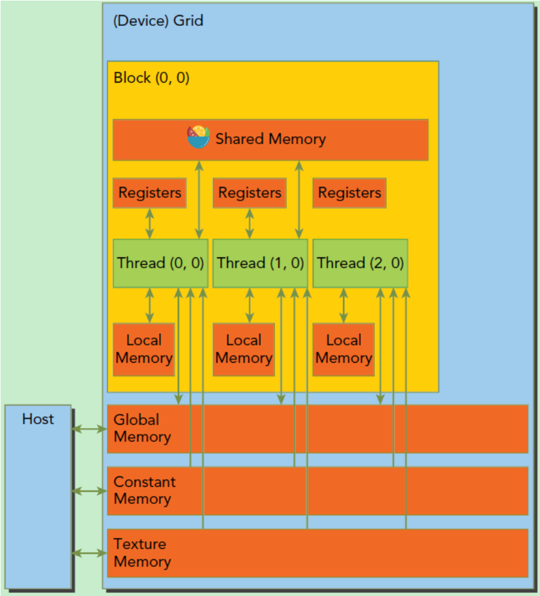

## Day 3

### 课程学习到的内容：

#### GPU中的矩阵乘法

**实现过程为：**

1、将输入矩阵块存放至共享内存中。

2、将输出矩阵的每一个元素的计算任务分配给一个独立的线程。

3、多个线程同时启动，每个线程计算局部乘积并相加。

4、每个线程将结果写回全局内存中对应的位置。

具体代码为：

```
// 获取矩阵A的(row, col)元素
__device__ float getElement(Matrix *A, int row, int col)
{
	return A->elements[row * A->width + col];
}

// 为矩阵A的(row, col)元素赋值
__device__ void setElement(Matrix *A, int row, int col, float value)
{
	A->elements[row * A->width + col] = value;
}

// 矩阵相乘kernel，2-D，每个线程计算一个元素
__global__ void matMulKernel(Matrix *A, Matrix *B, Matrix *C)
{
	float Cvalue = 0.0;
	int row = threadIdx.y + blockIdx.y * blockDim.y;
	int col = threadIdx.x + blockIdx.x * blockDim.x;
	for (int i = 0; i < A->width; ++i)
	{
		Cvalue += getElement(A, row, i) * getElement(B, i, col);
	}
	setElement(C, row, col, Cvalue);
}
```

### 一些概念的记录

#### 流式多处理器（SMs）

流式多处理器是英伟达GPU架构中的核心计算单元，以下是其详细介绍：

**结构组成**

• **处理核心**：包含多个CUDA核心、共享内存和寄存器等，是进行数据计算的基本单元，能高效处理各种计算任务，如整数运算、浮点运算等。

• **共享内存**：供同一SM内的线程共享数据和同步，可减少内存访问延迟，提高数据交互效率。

• **寄存器文件**：为线程提供快速数据存储，每个SM有大量寄存器，分配给运行的线程，加速数据处理。

• **特殊功能单元**：如用于处理超越函数的单元等，辅助完成复杂计算。

• **线程束调度器**：负责调度和管理SM内的线程束，决定线程束的执行顺序和时机，确保资源有效利用。

**工作原理**

• **并行处理数据**：可同时处理多个线程束（warps），大量CUDA核心并行工作，使GPU能同时处理大量数据，如在深度学习中同时处理多个图像数据。

• **指令执行**：从GPU内存取指令和数据，在CUDA核心执行，线程束内线程按顺序执行相同指令，处理不同数据元素，实现单指令多数据（SIMD）操作。

• **数据共享与同步**：线程通过共享内存交换数据和同步，如在计算中，线程将中间结果存共享内存，供其他线程使用，提高数据访问效率。

注意：网络和线程块只是逻辑划分，当一个kernel被执行时，它的gird中的线程块被分配到SM上去执行，因此SM才是执行的物理层。SM采用的是SIMT（单指令多线程）架构，基本的执行单元是线程束（warps）。

#### CUDA的内存结构

CUDA的内存结构如下图所示。每个线程有自己的**私有本地内存**（Local Memory），而每个线程块有包含**共享内存**（Shared Memory）,可以被线程块中所有线程共享，其生命周期与线程块一致。此外，所有的线程都可以访问**全局内存**（Global Memory）。还可以访问一些只读内存块：**常量内存**（Constant Memory）和**纹理内存**（Texture Memory）。



