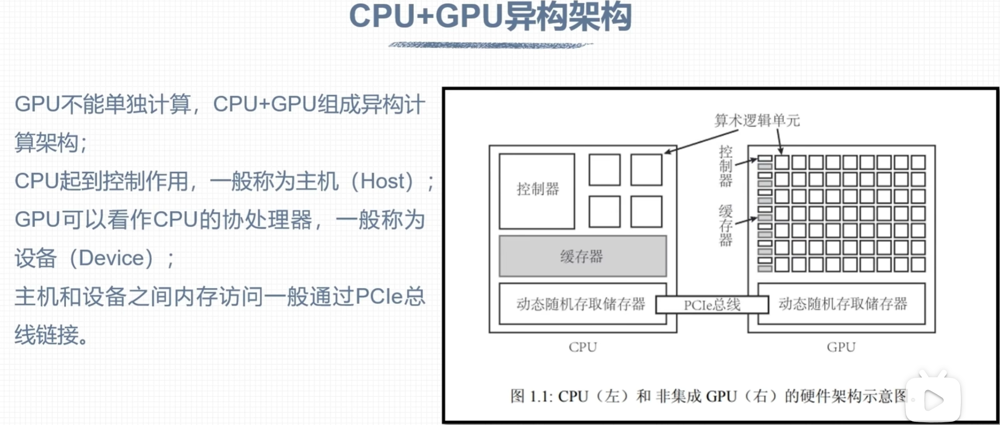
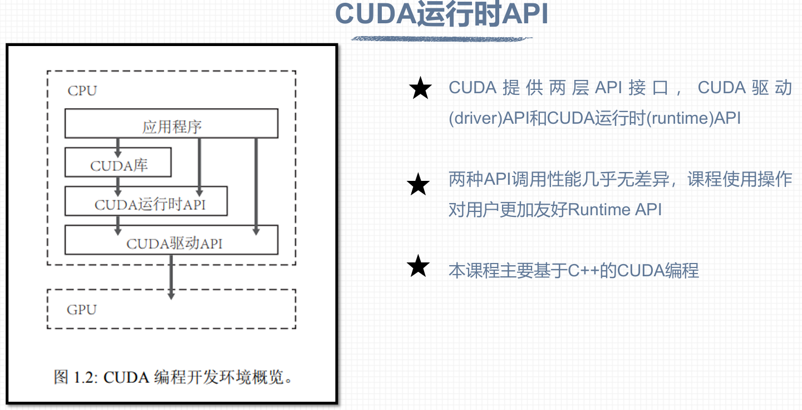
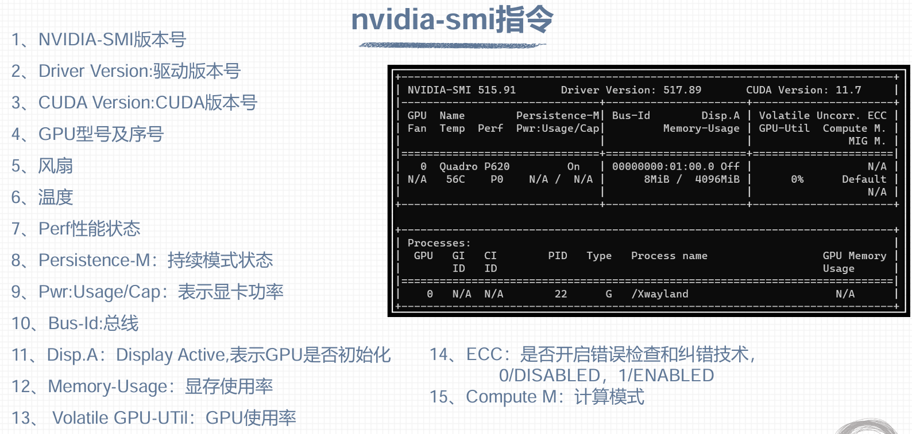

## Day 5

### 一些概念的记录：

#### GPU的性能指标：

GPU的内核数、GPU显存容量、GPU计算峰值和显存带宽。

注意：显存带宽就是运算单元与显存之间的通信速率；显存带宽越大，代表数据交换的速度越快，性能越高。

#### CPU+GPU异构架构

注意：CPU显存和GPU显存的数据访问是通过PCIE总线进行连接，但是，**PCIE总线上的数据传输速率相对毕竟慢**。因此**对于一个不复杂的任务，CPU和GPU数据传输的时间可能远远大于GPU计算的时间**。所以**在一些小型任务上的应用，GPU也未必得到加速的效果**。

#### CUDA的API接口

#### 

​       上述图中可通过应用程序（即CPU和GPU结合的代码）来控制GPU硬件平台。有两种控制方式：一种是在**已编写应用程序的基础**上**直接编写驱动程序文件**，来**控制CUDA的驱动API**，最终调用GPU来完成任务；另一种是在**已编写应用程序的基础****上**使用CUDA运行时API**，再将**运行时API转化成机械无生态的驱动层面的文件**，然后再进行CUDA的驱动和最终的GPU调用。

​        我们可以把**CUDA运行时API**理解成我们在编程时**使用C语言和C++进行程序的开发**，将**CUDA驱动API**理解为我们编写程序**使用的是汇编语言**。因此**CUDA运行时API对用户编程更为友好**。

#### nvidia-smi指令的界面参数说明

**显存使用率（Memory-Usage）和GPU使用率（Volatile GPU-UTil）的区别**：一般GPU使用率高时，显存使用率都比较高，但反之不一定。说明GPU在高速运算时，通常各种运算数据都已经载入内存中了。但某些情况下显存存满，但是GPU不一定在高速工作，例如在CPU和GPU进行数据传输时，GPU显卡的进程可能并没有计算，但是显存里面却可能存满了数据。
