## Day 6

### 一些概念的记录：

#### NVCC和CUDA文件的编译指令：

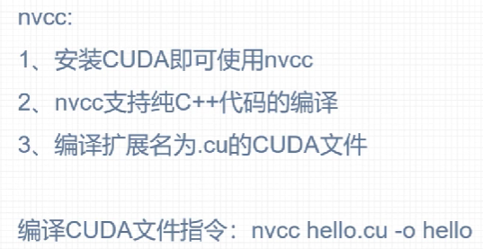

#### CUDA程序编写流程：

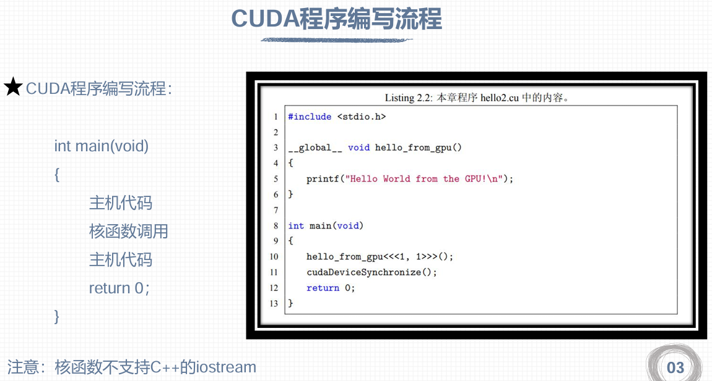

注意：第一个主机代码一般用来对**GPU进行一些配置**，以及**做数据处理方面的内容**；然后调用核函数进行并行加速数据处理；第二个主机代码一般会将**GPU运算处理后的数据回传给CPU**，以及**对GPU进行内存的释放工作**。

注意：cudaDeviceSynchronize()的作用是**同步CPU与GPU**。在CPU主机函数中调用核函数时，只是启动了核函数，但是CPU程序还是顺序执行的。

#### 一维线程模型：

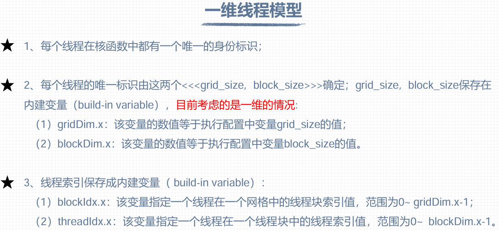

#### 多维线程模型：

.png)

.png)

#### 一维网格和一维线程块

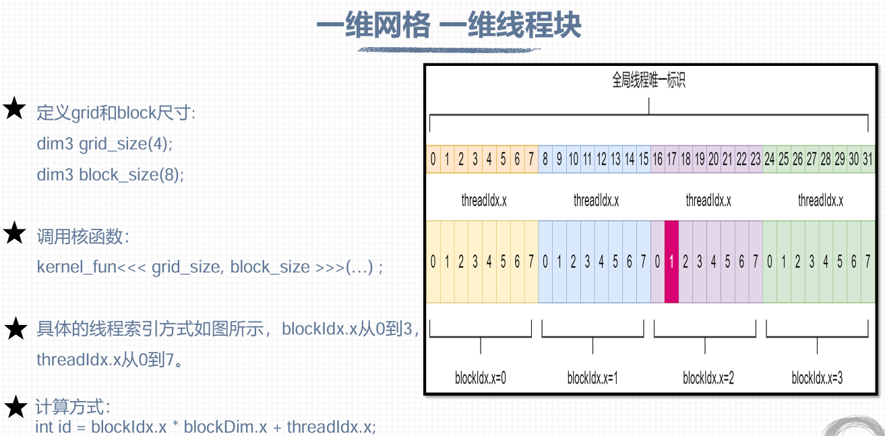

#### 二维网格和二维线程块

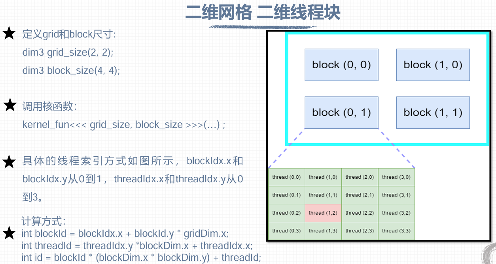

#### nvcc编译流程：

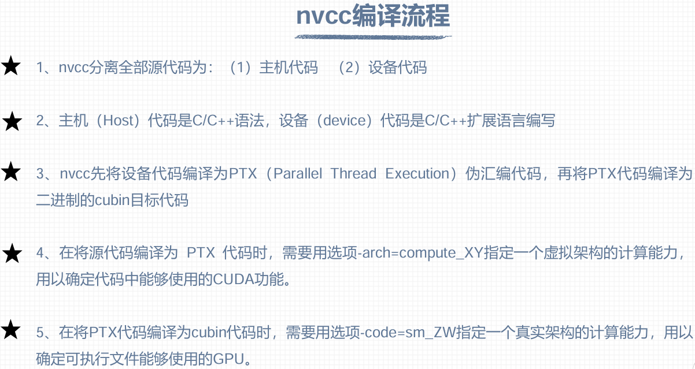

#### PTX：

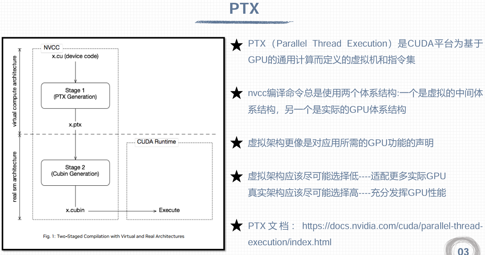

#### GPU计算能力：

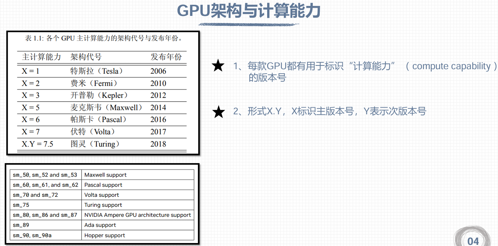

GPU的计算能力指的是**GPU在单位时间内执行大量数学运算（尤其是浮点运算）的能力**，主要由**FLOPS衡量**。

#### 指定虚拟架构和真实架构的计算能力的步骤：

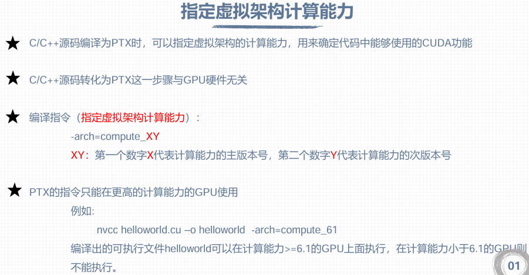

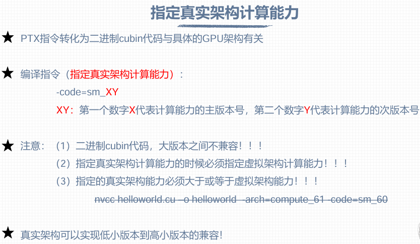

#### CUDA程序基本框架

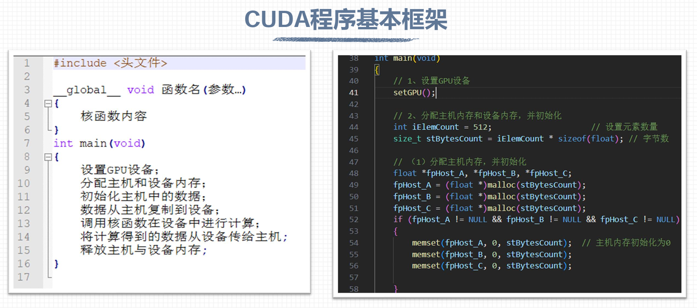

#### 内存管理

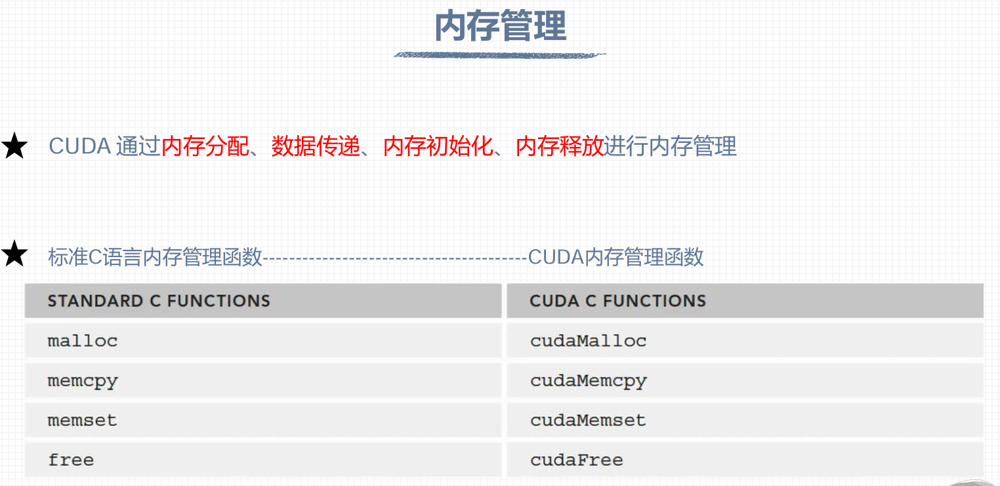

#### 错误检查函数

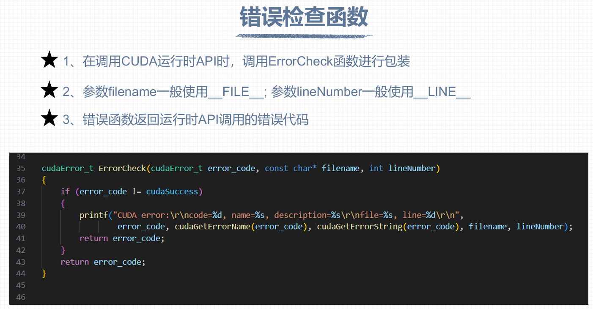

错误检查函数的示例如下：

```
cudaError_t error = ErrorCheck(cudaMalloc((float**)&fpDevice_A, 4), __FILE__, __LINE__);
```

#### 检查核函数的方法：

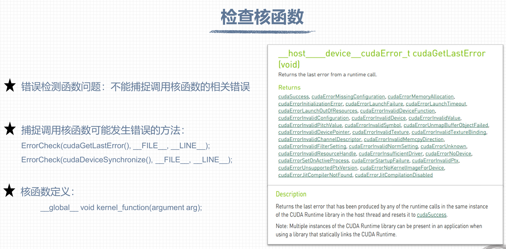


