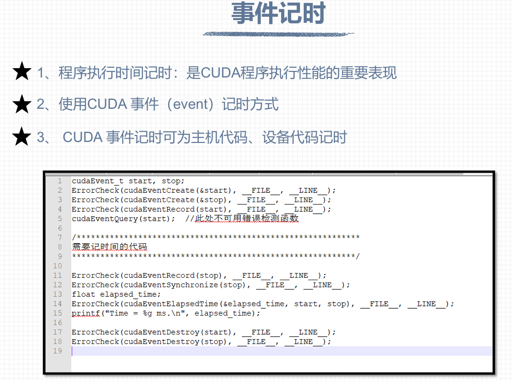
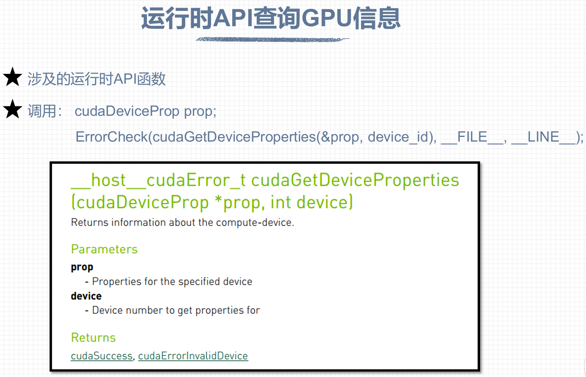
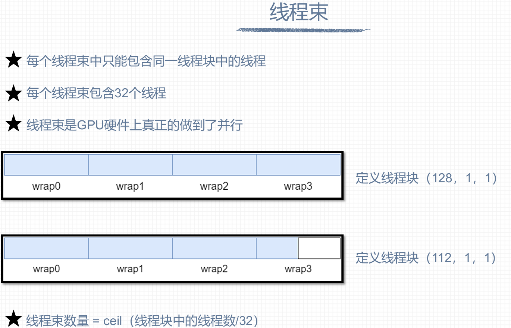
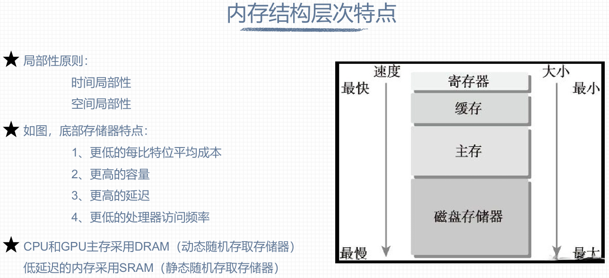

## Day 7

### 一些概念的记录：

#### CUDA程序性能的测试：

CUDA程序的性能体现在GPU的计算速度上，因此测试CUDA程序性能的方式为对程序进行计时。以下为CUDA事件记时方式：



上述代码中，cudaEventCreate()函数对两个用来计时的库的事件变量（即start和stop）进行初始化；cudaEventRecord(start,...)函数记录代表事件开始的时间；cudaEventQuery()函数保留就行；cudaEventRecord(stop,...)函数记录代表事件结束的时间；第十三到十五行是计算时间差；cudaEventDestroy()函数是销毁前面定义的事件变量。

#### CUDA程序性能的分析方式：

**1、nvprof指令**

使用nvcc对.cu程序文件进行编译后，生成的可执行文件通过nvprof指令运行，即可观察到该程序中CPU和GPU的占用情况。注意：计算能力在8.0及以上的显卡设备已不支持nvprof。目前使用**NVIDIA Nsight Systems**和**NVIDIA Nsight Compute**进行GPU性能分析。

**2、NVIDIA Nsight Systems和NVIDIA Nsight Compute**

NVIDIA Nsight Systems主要用途为系统级性能分析，GPU/CPU 时间线跟踪，资源占用分析；NVIDIA Nsight Compute主要用途：内核级详细性能分析，指令吞吐，内存访问模式；这两个性能分析工具都可以在NVIDIA官网中进行安装使用（可询问AI来了解具体使用方法）

#### 运行时API查询GPU信息



使用上述的运行时AIP函数来查询GPU信息的示例如下：

```
int main(void)
{
    int device_id = 0;
    ErrorCheck(cudaSetDevice(device_id), __FILE__, __LINE__);

    cudaDeviceProp prop;
    ErrorCheck(cudaGetDeviceProperties(&prop, device_id), __FILE__, __LINE__);

    printf("Device id:                                 %d\n",
        device_id);
    printf("Device name:                               %s\n",
        prop.name);
    printf("Compute capability:                        %d.%d\n",
        prop.major, prop.minor);
    printf("Amount of global memory:                   %g GB\n",
        prop.totalGlobalMem / (1024.0 * 1024 * 1024));
    printf("Amount of constant memory:                 %g KB\n",
        prop.totalConstMem  / 1024.0);
    printf("Maximum grid size:                         %d %d %d\n",
        prop.maxGridSize[0], 
        prop.maxGridSize[1], prop.maxGridSize[2]);
    printf("Maximum block size:                        %d %d %d\n",
        prop.maxThreadsDim[0], prop.maxThreadsDim[1], 
        prop.maxThreadsDim[2]);
    printf("Number of SMs:                             %d\n",
        prop.multiProcessorCount);
    printf("Maximum amount of shared memory per block: %g KB\n",
        prop.sharedMemPerBlock / 1024.0);
    printf("Maximum amount of shared memory per SM:    %g KB\n",
        prop.sharedMemPerMultiprocessor / 1024.0);
    printf("Maximum number of registers per block:     %d K\n",
        prop.regsPerBlock / 1024);
    printf("Maximum number of registers per SM:        %d K\n",
        prop.regsPerMultiprocessor / 1024);
    printf("Maximum number of threads per block:       %d\n",
        prop.maxThreadsPerBlock);
    printf("Maximum number of threads per SM:          %d\n",
        prop.maxThreadsPerMultiProcessor);

    return 0;
}
```

#### 流多处理器（SM）和线程束

.png)

注意上述图中“并发”和“并行”的区别：多个任务并发执行是指多个任务进行高速切换，看似是同时执行，但实际上运行核心在同一个时间节点只执行一项任务；而多个任务并行执行是指多个任务同时执行。



#### CPU内存结构层次特点



​        GPU在执行任务时，需要反复从内存中加载和存储数据。访问内存是比较耗时的，**访问内存数据**是**制约GPU计算速度的一个重要因素**，所以在计算任务时要尽量选择**低延迟，高带宽的内存**。

​        CPU和GPU都设计了内存层次结构。在访问数据或代码时，一般需要满足局部性原则。**时间局部性**是指：如果一个数据在一段时间内被访问，那么很有可能在短时间内被再次访问，随着时间推移，被再次访问的可能性也逐渐降低；**空间局部性**是指：如果一段地址被访问，那么这段地址附近的内存可能也会被访问，而且访问的概率随着距离增加而逐渐降低。

​        上图中可看出随着处理器内存延迟的增加，内存的容量也随之增加。**寄存器**是整个设备上**存取速度最快**的存储单元，但**容量最小**，是会**限制GPU运行性能**的**关键因素**；主存对于CPU来说就是讨论电脑存储性能时所说的8G/16G/32G/的运行内存；磁盘存储器对应计算机的硬盘。

#### CUDA内存模型

.png)

.png)

注意：线程只能从常量内存和纹理内存中读取数据，而主机可以从常量内存和纹理内存中读取和存储数据。

#### GPU缓存作用：


